# Complete Database Schema & Data Dictionary

**Project:** PERFORMAX — Intern Performance Management System (EPMS)  
**Database Engines:** PostgreSQL 16+ / MySQL 8.0+ / SQLite 3  
**Architecture:** 3rd Normal Form (3NF), UUID Primary Keys, Relational Integrity & Cascade Rules  
**Total Tables:** 49 Application Tables across 12 Modules  
**Date:** September 2026  

---

## 1. Entity-Relationship Diagram (ERD)

```mermaid
erDiagram
    %% Core Authentication & Profiles
    accounts_user ||--|| employees_employeeprofile : "has profile (1:1)"
    accounts_user ||--o{ accounts_rolepermission : "has permissions"
    accounts_user ||--o{ accounts_emailotp : "requests OTP"
    accounts_user ||--o{ accounts_passwordresettoken : "requests reset"

    %% Organization & Hierarchy
    organization_department ||--o{ employees_employeeprofile : "employs"
    organization_department ||--o{ organization_team : "contains"
    organization_team ||--o{ organization_teammembership : "members"
    employees_employeeprofile ||--o{ organization_teammembership : "belongs to"
    employees_employeeprofile ||--o{ employees_employeeprofile : "manages (recursive)"

    %% Goals & KPI Tracking
    performance_performancecycle ||--o{ goals_goal : "scopes"
    employees_employeeprofile ||--o{ goals_goal : "owns goals"
    accounts_user ||--o{ goals_goal : "assigns"
    goals_goal ||--o{ goals_kpi : "measured by"
    goals_goal ||--o{ goals_goalprogress : "progress log"
    goals_goal ||--o{ evidence_evidencesubmission : "verified by"

    %% Enterprise KPI Management
    goals_kpicategory ||--o{ goals_kpilibrary : "groups"
    goals_kpilibrary ||--o{ goals_kpilibrarydetail : "defines"
    goals_goalset ||--o{ goals_goalitem : "contains items"
    goals_goalitem ||--o{ goals_kpiprogressentry : "tracks updates"
    goals_goalset ||--o{ goals_kpiaudittrail : "audit logs"

    %% Appraisal & Evaluation Lifecycle
    performance_performancecycle ||--o{ performance_appraisal : "scopes"
    employees_employeeprofile ||--o{ performance_appraisal : "subject"
    accounts_user ||--o{ performance_appraisal : "reviewed by"
    performance_performancecycle ||--o{ performance_evaluationcriterion : "defines criteria"
    performance_appraisal ||--o{ performance_appraisalrating : "scores"
    performance_evaluationcriterion ||--o{ performance_appraisalrating : "criterion"
    performance_performancecycle ||--o{ performance_technicalcapabilityparameter : "defines parameters"
    performance_technicalcapabilityparameter ||--o{ performance_technicalcapabilityreview : "reviews"
    employees_employeeprofile ||--o{ performance_technicalcapabilityreview : "evaluated"

    %% Continuous Feedback & Engagement
    accounts_user ||--o{ feedback_feedback : "sends / receives"
    feedback_feedback ||--o{ feedback_feedbackcomment : "discussion"
    goals_goal ||--o{ feedback_feedback : "linked goal"

    %% Attendance, Training & PIP
    employees_employeeprofile ||--o{ attendance_attendancerecord : "logs daily"
    training_trainingcourse ||--o{ training_employeetraining : "enrolled in"
    employees_employeeprofile ||--o{ training_employeetraining : "completes"
    employees_employeeprofile ||--o{ performance_performanceimprovementplan : "placed on"
    employees_employeeprofile ||--o{ performance_recognitionreward : "awarded"

    %% Audit & Notifications
    accounts_user ||--o{ notifications_notification : "receives"
    accounts_user ||--o{ audit_auditlog : "actor"
```

---

## 2. Module-by-Module Schema Specification

### 2.1 Accounts & Authentication (`accounts`)

#### 1. `accounts_user`
Represents system users across all personas (`SUPER_ADMIN`, `HR`, `MANAGER`, `INTERN`).
| Column Name | Data Type | Constraints & Defaults | Description |
|---|---|---|---|
| `id` | `UUID` | **PRIMARY KEY**, default `uuid_generate_v4()` | Unique user identifier |
| `username` | `VARCHAR(150)` | **UNIQUE**, **NOT NULL**, **INDEXED** | Login handle |
| `email` | `VARCHAR(254)` | **UNIQUE**, **NOT NULL**, **INDEXED** | Primary corporate email |
| `password` | `VARCHAR(128)` | **NOT NULL** | PBKDF2/Argon2 encrypted hash |
| `role` | `VARCHAR(20)` | **NOT NULL**, `CHECK(role IN ('SUPER_ADMIN', 'HR', 'MANAGER', 'INTERN'))` | Assigned primary system persona |
| `is_active` | `BOOLEAN` | `DEFAULT TRUE`, **NOT NULL** | Account activation flag |
| `is_staff` | `BOOLEAN` | `DEFAULT FALSE`, **NOT NULL** | Django admin portal access |
| `is_superuser` | `BOOLEAN` | `DEFAULT FALSE`, **NOT NULL** | Superuser bypass flag |
| `password_change_required` | `BOOLEAN` | `DEFAULT FALSE`, **NOT NULL** | Enforces password change on first login |
| `password_changed_at` | `TIMESTAMPTZ` | `NULLABLE` | Timestamp of permanent password setup |
| `date_joined` | `TIMESTAMPTZ` | `DEFAULT NOW()`, **NOT NULL** | Registration timestamp |
| `last_login` | `TIMESTAMPTZ` | `NULLABLE` | Last successful login timestamp |
| `updated_at` | `TIMESTAMPTZ` | `DEFAULT NOW()`, **NOT NULL** | Last mutation timestamp |

#### 2. `accounts_rolepermission`
Dynamic permission matrix mapping personas to granular system actions.
| Column Name | Data Type | Constraints | Description |
|---|---|---|---|
| `id` | `UUID` | **PRIMARY KEY** | Unique permission rule ID |
| `role` | `VARCHAR(20)` | **NOT NULL**, **INDEXED** | Target role |
| `permission_code` | `VARCHAR(100)` | **NOT NULL**, **INDEXED** | E.g. `CYCLE_PUBLISH`, `TASK_ASSIGN` |
| `description` | `VARCHAR(255)` | `BLANK` | Human-readable explanation |
| *Constraints* | `UNIQUE(role, permission_code)` | | Prevents duplicate permission assignments |

#### 3. `accounts_emailotp`
Stores short-lived 6-digit verification codes for self-registration and password recovery.
| Column | Type | Constraints | Description |
|---|---|---|---|
| `id` | `UUID` | **PRIMARY KEY** | OTP ID |
| `email` | `VARCHAR(254)` | **NOT NULL**, **INDEXED** | Target email |
| `otp_code` | `VARCHAR(6)` | **NOT NULL** | 6-digit numeric token |
| `expires_at` | `TIMESTAMPTZ` | **NOT NULL** | 10-minute expiry timestamp |
| `is_used` | `BOOLEAN` | `DEFAULT FALSE` | Consumption flag |

---

### 2.2 Organization Structure (`organization`)

#### 4. `organization_department`
Corporate business units (e.g., Engineering, QA, Product, HR).
| Column | Type | Constraints | Description |
|---|---|---|---|
| `id` | `UUID` | **PRIMARY KEY** | Department identifier |
| `name` | `VARCHAR(100)` | **UNIQUE**, **NOT NULL** | Department title |
| `code` | `VARCHAR(20)` | **UNIQUE**, `NULLABLE` | Short code (e.g. `ENG`, `QA`) |
| `description` | `TEXT` | `NULLABLE` | Department overview |
| `is_active` | `BOOLEAN` | `DEFAULT TRUE` | Active status |

#### 5. `organization_team`
Sub-units / squads within departments.
| Column | Type | Constraints | Description |
|---|---|---|---|
| `id` | `UUID` | **PRIMARY KEY** | Team identifier |
| `department_id` | `UUID` | **FK** -> `organization_department(id)`, **CASCADE** | Parent department |
| `manager_id` | `UUID` | **FK** -> `accounts_user(id)`, `SET NULL`, `NULLABLE` | Lead manager / mentor |
| `name` | `VARCHAR(100)` | **NOT NULL** | Team name |
| *Constraints* | `UNIQUE(department_id, name)` | | Unique team name per department |

#### 6. `organization_joblevel` & `organization_position`
Manages role hierarchies, bands (L01 to L10), and official designations.
| Table | Key Columns | Relationships |
|---|---|---|
| `organization_joblevel` | `id`, `name`, `code`, `rank_order`, `description` | Defines career ladders |
| `organization_position` | `id`, `department_id`, `job_level_id`, `title` | Formal organizational seats |

---

### 2.3 Employees & Directory (`employees`)

#### 7. `employees_employeeprofile`
Core employee profile linking personal details, organizational hierarchy, and manager.
| Column Name | Data Type | Constraints | Description |
|---|---|---|---|
| `id` | `UUID` | **PRIMARY KEY** | Profile identifier |
| `user_id` | `UUID` | **FK** -> `accounts_user(id)`, **UNIQUE**, **CASCADE** | Associated login account |
| `employee_code` | `VARCHAR(50)` | **UNIQUE**, **NOT NULL**, **INDEXED** | E.g. `DLQ-A1-001`, `EMP-MGR-001` |
| `first_name` | `VARCHAR(100)` | **NOT NULL** | Given name |
| `last_name` | `VARCHAR(100)` | **NOT NULL** | Surname |
| `department_id` | `UUID` | **FK** -> `organization_department(id)`, `SET NULL` | Assigned department |
| `manager_id` | `UUID` | **FK** -> `accounts_user(id)`, `SET NULL`, **INDEXED** | Direct supervisor / Mentor |
| `designation` | `VARCHAR(100)` | **NOT NULL** | Position title |
| `employment_status`| `VARCHAR(20)` | `CHECK(status IN ('ACTIVE','PROBATION','COMPLETED','TERMINATED'))` | Employment state |
| `joining_date` | `DATE` | `NULLABLE` | Official start date |
| `phone_number` | `VARCHAR(20)` | `NULLABLE` | Contact phone |
| `competencies` | `JSON` / `JSONB` | `DEFAULT '[]'` | Skill profile & ratings matrix |

---

### 2.4 Performance Cycles & Appraisals (`performance`)

#### 8. `performance_performancecycle`
Configurable appraisal time windows with mathematical weight configurations.
| Column Name | Data Type | Constraints | Description |
|---|---|---|---|
| `id` | `UUID` | **PRIMARY KEY** | Cycle identifier |
| `name` | `VARCHAR(150)` | **NOT NULL** | E.g. "Summer 2026 Appraisal Cycle" |
| `start_date` | `DATE` | **NOT NULL** | Cycle start date |
| `end_date` | `DATE` | **NOT NULL** | Cycle conclusion date |
| `status` | `VARCHAR(20)` | `CHECK(status IN ('DRAFT','ACTIVE','REVIEW_PERIOD','CLOSED'))` | Current lifecycle phase |
| `goals_weight` | `NUMERIC(5,2)`| `DEFAULT 40.00`, `CHECK(0-100)` | Weight percentage for Goals/KPIs |
| `manager_weight`| `NUMERIC(5,2)`| `DEFAULT 40.00`, `CHECK(0-100)` | Weight percentage for Manager Evaluation |
| `self_weight` | `NUMERIC(5,2)`| `DEFAULT 20.00`, `CHECK(0-100)` | Weight percentage for Intern Self-Review |
| `self_assessment_deadline` | `DATE` | `NULLABLE` | Self-review submission cutoff |
| `evidence_deadline` | `DATE` | `NULLABLE` | Deliverable submission cutoff |
| *Constraints* | `CHECK(end_date >= start_date)` | | Prevents backward date cycles |

#### 9. `performance_evaluationcriterion`
Evaluation parameters and criteria sets scored by managers.
| Column | Type | Constraints | Description |
|---|---|---|---|
| `id` | `UUID` | **PRIMARY KEY** | Criterion identifier |
| `cycle_id` | `UUID` | **FK** -> `performance_performancecycle(id)`, **CASCADE** | Associated cycle |
| `name` | `VARCHAR(150)` | **NOT NULL** | E.g. "Technical Problem Solving" |
| `weight` | `NUMERIC(5,2)` | **NOT NULL**, `CHECK(0-100)` | Relative percentage weight |
| `maximum_score`| `NUMERIC(5,2)` | `DEFAULT 100.00` | Benchmark maximum scale |

#### 10. `performance_appraisal`
The central evaluation record for an employee in a given cycle.
| Column Name | Data Type | Constraints | Description |
|---|---|---|---|
| `id` | `UUID` | **PRIMARY KEY** | Appraisal ID |
| `employee_id` | `UUID` | **FK** -> `employees_employeeprofile(id)`, **CASCADE** | Subject employee |
| `cycle_id` | `UUID` | **FK** -> `performance_performancecycle(id)`, **CASCADE** | Performance cycle |
| `reviewer_id` | `UUID` | **FK** -> `accounts_user(id)`, `SET NULL` | Evaluating manager / mentor |
| `status` | `VARCHAR(20)` | `CHECK(status IN ('DRAFT','SUBMITTED','UNDER_REVIEW','HR_APPROVED','PUBLISHED'))` | Privacy-gated status |
| `overall_score` | `NUMERIC(5,2)`| `NULLABLE` | Calculated final composite grade |
| `classification`| `VARCHAR(50)` | `NULLABLE` | E.g. "Outstanding", "Exceeds Expectations" |
| `allow_intern_reply` | `BOOLEAN` | `DEFAULT TRUE` | Permits intern to submit reflection |
| `self_comments` | `TEXT` | `BLANK` | Intern's self reflection |
| `reviewer_comments` | `TEXT` | `BLANK` | Mentor evaluation feedback |
| `submitted_at` | `TIMESTAMPTZ` | `NULLABLE` | Manager submission timestamp |
| `published_at` | `TIMESTAMPTZ` | `NULLABLE` | Official HR publishing timestamp |
| *Constraints* | `UNIQUE(employee_id, cycle_id)` | | Exactly one appraisal per cycle |

#### 11. `performance_appraisalrating`
Itemized score given to an appraisal for each evaluation criterion.
| Column | Type | Constraints | Description |
|---|---|---|---|
| `id` | `UUID` | **PRIMARY KEY** | Rating identifier |
| `appraisal_id` | `UUID` | **FK** -> `performance_appraisal(id)`, **CASCADE** | Parent appraisal |
| `criterion_id` | `UUID` | **FK** -> `performance_evaluationcriterion(id)`, **CASCADE** | Evaluated criterion |
| `score` | `NUMERIC(5,2)` | **NOT NULL** | Awarded score |
| `comments` | `TEXT` | `BLANK` | Specific justification |
| *Constraints* | `UNIQUE(appraisal_id, criterion_id)` | | Exactly one rating per criterion |

#### 12. `performance_technicalcapabilityparameter` & `review`
Technical competency benchmarking matrix scored by mentors (Features M-04 & M-05).
- `performance_technicalcapabilityparameter`: Stores technical parameters (`benchmark_score`, `category`, `weight`).
- `performance_technicalcapabilityreview`: Stores mentor review evaluations against these benchmarks.

---

### 2.5 Goals & KPI Engine (`goals`)

#### 13. `goals_goal`
Deliverables and high-level milestones assigned to interns.
| Column Name | Data Type | Constraints | Description |
|---|---|---|---|
| `id` | `UUID` | **PRIMARY KEY** | Goal identifier |
| `employee_id` | `UUID` | **FK** -> `employees_employeeprofile(id)`, **CASCADE** | Target intern |
| `cycle_id` | `UUID` | **FK** -> `performance_performancecycle(id)`, **CASCADE** | Scoping cycle |
| `assigned_by_id` | `UUID` | **FK** -> `accounts_user(id)`, `SET NULL` | Manager who assigned task |
| `title` | `VARCHAR(200)` | **NOT NULL** | Goal title |
| `description` | `TEXT` | `BLANK` | Specifications |
| `priority` | `VARCHAR(10)` | `CHECK(priority IN ('LOW','MEDIUM','HIGH','CRITICAL'))` | Urgency tier |
| `status` | `VARCHAR(20)` | `CHECK(status IN ('NOT_STARTED','IN_PROGRESS','IN_REVIEW','COMPLETED','BLOCKED'))` | Current progress status |
| `completion_percentage` | `NUMERIC(5,2)` | `DEFAULT 0.00`, `CHECK(0-100)` | Quantitative progress |
| `due_date` | `DATE` | **NOT NULL** | Deadline |

#### 14. `goals_kpi`
Quantitative metric attached to a goal.
| Column | Type | Constraints | Description |
|---|---|---|---|
| `id` | `UUID` | **PRIMARY KEY** | KPI identifier |
| `goal_id` | `UUID` | **FK** -> `goals_goal(id)`, **CASCADE** | Parent goal |
| `name` | `VARCHAR(150)` | **NOT NULL** | Metric description |
| `target_value` | `NUMERIC(10,2)` | **NOT NULL** | Target benchmark (e.g. 100) |
| `achieved_value`| `NUMERIC(10,2)` | `DEFAULT 0.00` | Currently completed units |
| `unit` | `VARCHAR(20)` | `DEFAULT '%'` | Metric unit (`%`, `Count`, `Hours`) |

#### 15. `goals_goalprogress`
Audit trail of progressive updates made by an intern toward goal completion.
| Column | Type | Constraints | Description |
|---|---|---|---|
| `id` | `UUID` | **PRIMARY KEY** | Progress update ID |
| `goal_id` | `UUID` | **FK** -> `goals_goal(id)`, **CASCADE** | Goal |
| `reported_by_id` | `UUID` | **FK** -> `accounts_user(id)`, `SET NULL` | Submitting actor |
| `progress_percentage` | `NUMERIC(5,2)` | **NOT NULL** | Updated percentage |
| `notes` | `TEXT` | `BLANK` | Progress description |
| `created_at` | `TIMESTAMPTZ` | `DEFAULT NOW()` | Timestamp |

---

### 2.6 Verifiable Evidence & Continuous Feedback (`evidence` & `feedback`)

#### 16. `evidence_evidencesubmission`
External verifiable artifacts (e.g. GitHub PR links, documents) backing completed goals.
| Column Name | Data Type | Constraints | Description |
|---|---|---|---|
| `id` | `UUID` | **PRIMARY KEY** | Evidence ID |
| `employee_id` | `UUID` | **FK** -> `employees_employeeprofile(id)`, **CASCADE** | Submitting intern |
| `goal_id` | `UUID` | **FK** -> `goals_goal(id)`, **CASCADE** | Backed deliverable |
| `title` | `VARCHAR(150)` | **NOT NULL** | Submission title |
| `external_url` | `VARCHAR(500)` | `NULLABLE` | PR link, Figma URL, doc link |
| `file_attachment` | `VARCHAR(100)` | `NULLABLE` | Local media storage upload |
| `review_status` | `VARCHAR(20)` | `CHECK(status IN ('PENDING','APPROVED','REJECTED','REVISION_REQUESTED'))` | Mentor review outcome |
| `reviewed_by_id` | `UUID` | **FK** -> `accounts_user(id)`, `SET NULL` | Mentor evaluator |
| `review_notes` | `TEXT` | `NULLABLE` | Evaluation notes |
| `reviewed_at` | `TIMESTAMPTZ` | `NULLABLE` | Decision timestamp |

#### 17. `feedback_feedback` & `feedback_feedbackcomment`
Continuous performance praise, coaching, and reflection exchanges.
| Column | Type | Constraints | Description |
|---|---|---|---|
| `id` | `UUID` | **PRIMARY KEY** | Feedback ID |
| `sender_id` | `UUID` | **FK** -> `accounts_user(id)`, **CASCADE** | Feedback author |
| `recipient_id` | `UUID` | **FK** -> `accounts_user(id)`, **CASCADE** | Feedback recipient |
| `feedback_type` | `VARCHAR(20)` | `CHECK(type IN ('POSITIVE','PRAISE','COACHING','CONSTRUCTIVE'))` | Feedback categorization |
| `visibility` | `VARCHAR(20)` | `CHECK(visibility IN ('PUBLIC','PRIVATE','MANAGERS_ONLY'))` | Access scope |
| `message` | `TEXT` | **NOT NULL** | Feedback message content |

---

### 2.7 Attendance, Training & Audit Trail (`attendance`, `training`, `audit`)

#### 18. `attendance_attendancerecord`
Daily presence tracking with unique constraint per employee per date.
| Column | Type | Constraints | Description |
|---|---|---|---|
| `id` | `UUID` | **PRIMARY KEY** | Attendance ID |
| `employee_id` | `UUID` | **FK** -> `employees_employeeprofile(id)`, **CASCADE** | Employee |
| `date` | `DATE` | **NOT NULL** | Calendar date |
| `status` | `VARCHAR(20)` | `CHECK(status IN ('PRESENT','ABSENT','LEAVE','WORK_FROM_HOME','HALF_DAY'))` | Attendance mark |
| *Constraints* | `UNIQUE(employee_id, date)` | | Enforces one attendance mark per day |

#### 19. `audit_auditlog`
Immutable, tamper-evident log capturing every administrative mutation.
| Column | Type | Constraints | Description |
|---|---|---|---|
| `id` | `UUID` | **PRIMARY KEY** | Log ID |
| `actor_id` | `UUID` | **FK** -> `accounts_user(id)`, `SET NULL` | User performing action |
| `action` | `VARCHAR(50)` | **NOT NULL**, **INDEXED** | Action verb (e.g. `CYCLE_PUBLISHED`, `PERMISSION_CHANGED`) |
| `entity_type` | `VARCHAR(50)` | **NOT NULL**, **INDEXED** | Model name |
| `entity_id` | `VARCHAR(100)` | **NOT NULL** | Record UUID |
| `ip_address` | `INET` / `VARCHAR(45)` | `NULLABLE` | Origin IP |
| `old_values` | `JSON` / `JSONB` | `DEFAULT '{}'` | State before mutation |
| `new_values` | `JSON` / `JSONB` | `DEFAULT '{}'` | State after mutation |
| `timestamp` | `TIMESTAMPTZ` | `DEFAULT NOW()`, **INDEXED** | Audit event time |

---

## 3. Database Integrity & Indexing Strategy

1. **UUID Primary Keys:** All application tables use 128-bit UUID v4 to eliminate sequential enumeration vulnerabilities and support multi-region replication.
2. **Compound Unique Indexes:**
   - `accounts_rolepermission`: `(role, permission_code)`
   - `attendance_attendancerecord`: `(employee_id, date)`
   - `performance_appraisal`: `(employee_id, cycle_id)`
   - `performance_appraisalrating`: `(appraisal_id, criterion_id)`
   - `organization_team`: `(department_id, name)`
3. **Foreign Key Cascade Policies:**
   - **`CASCADE`**: Direct child records (e.g. deleting an `Appraisal` cascades to its `AppraisalRating` rows; deleting a `Goal` cascades to its `KPI` rows).
   - **`SET NULL`**: Auditor/Reviewer references (e.g. deleting a `User` retains historical `Appraisal` records with `reviewer_id = NULL`).
